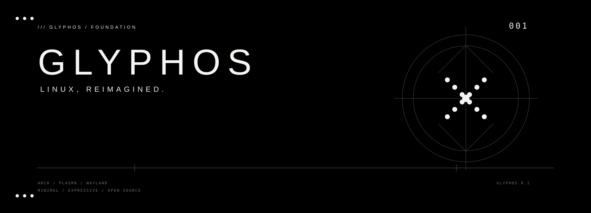
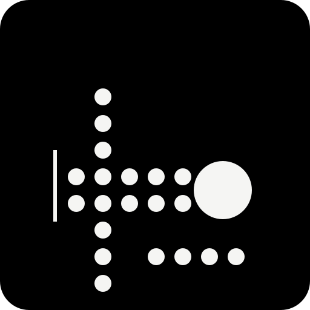

<div align="center">



# GlyphOS

**A Nothing-inspired Linux desktop, built on KDE Plasma.**

Minimal. Expressive. Linux.

</div>

## Status

**Phase: Foundation → Desktop bring-up**

GlyphOS is an independent Arch-based Linux desktop project focused on a minimal, expressive, monochrome-first experience. KDE Plasma is the desktop foundation; GlyphOS progressively replaces its presentation layer instead of implementing a desktop environment from scratch.

## Stack

- Arch Linux
- KDE Plasma
- Wayland / KWin
- SDDM
- PipeWire
- NetworkManager
- ArchISO

## Visual identity

The GlyphOS design system uses AMOLED black, crisp monochrome typography, geometric indicators, dot-matrix motifs, thin technical lines, and large negative space.



GlyphOS is an independent project and is **not an official Nothing product**. Nothing proprietary artwork, software, fonts, logos, or interface assets are not bundled with GlyphOS.

## Repository layout

```
.
├── branding/
│   ├── glyphos-mark.svg
│   └── glyphos-banner.svg
├── docs/
├── profile/
├── scripts/
├── Makefile
└── README.md
```

## Build

On an Arch Linux host:

```bash
sudo pacman -S --needed archiso git qemu-desktop edk2-ovmf
make validate
make build
```

The generated ISO is written to `out/`.

For a local QEMU test:

```bash
make run
```

See [docs/BUILDING.md](docs/BUILDING.md) for the full workflow.

## Roadmap

- [x] Establish project identity and branding
- [x] Create the first ArchISO foundation
- [x] Boot into a live KDE Plasma session
- [x] Establish GlyphOS dark color system
- [x] Integrate GlyphOS mark and wallpaper into the live image
- [ ] Build a first GlyphOS Plasma layout
- [ ] Replace the stock panel and launcher experience
- [ ] Add GlyphOS quick settings and notification surfaces
- [ ] Create the GlyphOS lock screen and login experience
- [ ] Build first-party GlyphOS settings
- [ ] Create a polished installer
- [ ] Add hardware-aware defaults
- [ ] Produce reproducible release ISOs

## Documentation

- [Architecture](docs/ARCHITECTURE.md)
- [Design language](docs/DESIGN.md)
- [Building](docs/BUILDING.md)

## License

GlyphOS is under active development. License terms for original GlyphOS code and assets will be added before the first public release.
